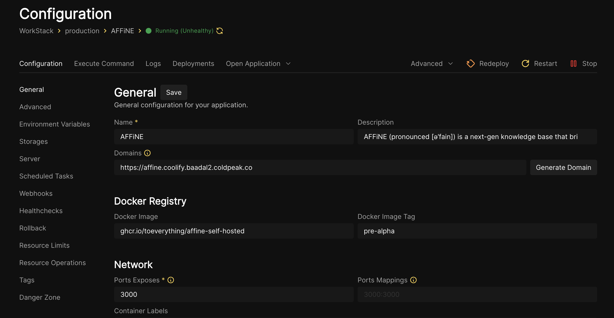

# Run AFFiNE on Coolify
1. Use the option "Based on an existing Docker Image"
2. Use the following configuration:
   

> Note: The pre-alpha version doesn't really do anything except for giving you a demo. We recommend self-hosting [Outline](https://github.com/grayhatdevelopers/outline-coolify/) instead.
